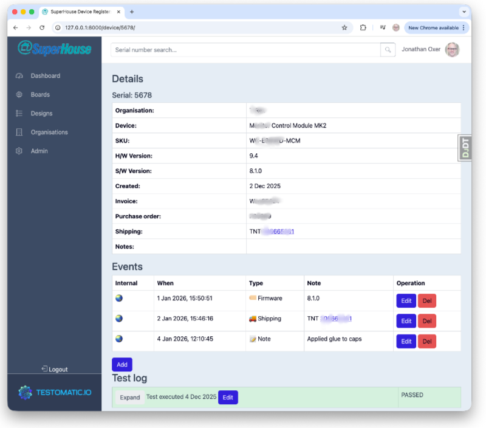

# Testomatic Circuit Board Register

This Register provides a central location for storing production and testing 
data related to printed circuit board assembly (PCBA) services. It was 
created for storing data produced by the [Testomatic](https://github.com/superhouse/testomatic) 
PCB test jig system, but it doesn't require Testomatic to operate. You can 
use this Register independently, even without a PCB testing system at all. Its 
job is simply to store and report information about individual PCBs 
regardless of how the data is obtained.

It includes:

 * A database for storage of information relating to individual boards
 * Image storage to associate images with test records or boards
 * File asset storage to associate design files, BOMs, firmware binaries, and other documents with board designs
 * An internal web UI for managing records of boards and tests
 * An external web UI for customers to look up details of specific boards
 * An API for updating data stored in the system
 * Supporting scripts to process photos of PCBs, extract serial numbers from barcodes, and store them

Data is stored in a hierarchical manner:

**Organisations** can represent customers such as companies that have 
purchased or commissioned the assembly of boards.

**Users** have access to the system through a username and password, and 
are associated with one or more organisations.

**Designs** represent a type of circuit board, and are associated with an 
organisation. Design files, BOMs, firmware binaries, and other assets can 
be attached directly to a design for easy reference.

**Boards** represent individual circuit boards with a serial number 
assigned, which are an embodiment of a design.



It's written as a Django + React application and can use either SQLite 
or MariaDB / MySQL.

## Supplier API Integration

The Parts library can look up component data from LCSC, DigiKey, and Mouser to auto-populate part source records (manufacturer SKU, stock, packaging, description, and product image).

## LCSC API Integration

LCSC lookup uses the [`lcsc`](https://pypi.org/project/lcsc/) Python library and requires no API key or account. It works out of the box.

## DigiKey API Integration

DigiKey lookup requires a free DigiKey developer account and a one-time OAuth setup.

### 1. Register a DigiKey API application

1. Sign in or create an account at [developer.digikey.com](https://developer.digikey.com)
2. Create a new application and subscribe it to the **Production Information V4** API product
3. When asked for an **OAuth Callback URL**, enter:
   ```
   https://localhost:8000/parts/source/digikey-callback/
   ```
   (For a production deployment, use your actual domain, e.g. `https://register.example.com/parts/source/digikey-callback/`)
4. Once the application is created, copy the **Client ID** and **Client Secret**

### 2. Configure the environment

Create a directory to store the OAuth token:

```bash
mkdir pyproj/.digikey
```

Add the following to `pyproj/.env`:

```
DIGIKEY_CLIENT_ID = "your-client-id"
DIGIKEY_CLIENT_SECRET = "your-client-secret"
DIGIKEY_STORAGE_PATH = "/absolute/path/to/pyproj/.digikey"
DIGIKEY_CLIENT_SANDBOX = False
```

Set `DIGIKEY_CLIENT_SANDBOX = True` if your DigiKey application only has sandbox (not production) API access. Note that the sandbox catalog contains only a limited set of test parts.

> **Production warning:** `.env` is only read at process startup (`load_dotenv()` in `conf/settings.py`). On a server, the uWSGI worker keeps whatever values it read when it last started, while every `manage.py` invocation (e.g. the `refresh_part_sources` cron job) re-reads the current `.env` file fresh. If you ever edit `DIGIKEY_CLIENT_SANDBOX`, `DIGIKEY_CLIENT_ID`, or `DIGIKEY_CLIENT_SECRET` in production without restarting uWSGI (`sudo touch /etc/uwsgi-emperor/vassals/register.ini`), the two will disagree about which DigiKey API host to use while sharing the *same* `token_storage.json` — the web app keeps working (it's still using the old, matching value), but the management command starts sending a token issued for one API host to the other, failing with errors like `Token refresh failed (500)` or `401: You are not subscribed to this API`. Always restart uWSGI after changing any DigiKey `.env` value.

### 3. Set up local HTTPS for development

DigiKey requires HTTPS for the OAuth callback, even on localhost. The easiest approach uses `mkcert` to create a locally-trusted certificate and `runserver_plus` (included with `django-extensions`, which is already installed) to serve over HTTPS.

Install `mkcert` and generate a localhost certificate:

```bash
brew install mkcert
mkcert -install
cd pyproj
mkcert localhost
```

This creates `localhost.pem` and `localhost-key.pem` in `pyproj/`.

### 4. Complete the one-time OAuth flow

Start the development server with SSL:

```bash
cd pyproj
source venv/bin/activate
python manage.py runserver_plus --cert-file localhost.pem --key-file localhost-key.pem
```

Then visit:

```
https://localhost:8000/parts/source/digikey-connect/
```

This redirects to the DigiKey login page. After you log in and grant access, DigiKey redirects back to the app, which exchanges the code for a token and saves it to `DIGIKEY_STORAGE_PATH`. The token refreshes automatically on subsequent use — this step is only needed once (or if the refresh token expires).

> **Note:** For day-to-day use after the token is saved, you can run the normal `python manage.py runserver` without SSL — HTTPS is only needed for the initial OAuth flow.

## Mouser API Integration

Mouser lookup requires a free Mouser developer account. Unlike DigiKey, authentication is a simple API key — no OAuth flow is needed.

### 1. Register for a Mouser Search API key

1. Sign in or create an account at [mouser.com/api-hub](https://www.mouser.com/api-hub/)
2. Under **Search API**, generate an API key
3. Copy the key

### 2. Configure the environment

Add the following to `pyproj/.env`:

```
MOUSER_SEARCH_API_KEY = "your-api-key"
```

Restart the development server and the Mouser fetch button will be active immediately — no further setup is required.

## Element14 / Farnell / Newark API Integration

Element14 lookup (also covers Farnell and Newark regional storefronts) requires a free developer account. Like Mouser, it uses a simple API key — no OAuth flow is needed.

### 1. Register for an Element14 API key

1. Sign in or create an account at [partner.element14.com](https://partner.element14.com)
2. Create a new application and note the **API key**

### 2. Configure the environment

Add the following to `pyproj/.env`:

```
ELEMENT14_API_KEY = "your-api-key"
ELEMENT14_STORE_ID = "au.element14.com"
```

Set `ELEMENT14_STORE_ID` to the regional storefront you source from:

| Region | Store ID |
|---|---|
| Australia / Asia-Pacific | `au.element14.com` |
| UK / Europe | `uk.farnell.com` |
| USA | `www.newark.com` |

Restart the development server and the E14 fetch button will be active immediately.

## Data Export and Import

All application data (database records and uploaded media files) can be exported
to a self-contained ZIP archive and imported into another installation.

### Exporting

```bash
cd pyproj
python manage.py export_data [output.zip]
```

If no output path is given, the archive is written to the current directory as
`register-export-YYYY-MM-DD.zip`.

The archive contains:
- `manifest.json` — export timestamp, app version, record count
- `data.json` — all records from the `crm`, `device`, and `erp` apps
- `media/` — all uploaded files (design assets, device assets, images, etc.)

User accounts are **not** included; users must be re-created on the target
installation manually. Thumbnail cache files are also excluded — they regenerate
on first access.

### Importing

```bash
cd pyproj
python manage.py import_data export.zip
```

The command shows details from the archive and asks for confirmation before
making any changes. To skip the prompt (e.g. in a script), pass `--yes`:

```bash
python manage.py import_data export.zip --yes
```

**The import permanently deletes all existing application data before loading
the archive.** This is a clean-slate replace, not a merge. Make sure you have
your own export or backup before running this on an installation with data you
want to keep.

The import is database-transactional: if loading the records fails for any
reason, the database is rolled back to its state before the import started.
Media file restoration happens after the database is committed and is not
transactional; if it is interrupted, re-running the import from the same
archive will restore a consistent state.

## License

Copyright (C) 2026 SuperHouse Automation Pty Ltd

This program is free software: you can redistribute it and/or modify it under the terms of the [GNU Affero General Public License](LICENSE) as published by the Free Software Foundation, either version 3 of the License, or (at your option) any later version.

Because this software is licensed under the AGPL, if you run a modified version as a network service, you must make the corresponding source code available to users of that service. The source code for this project is available at [https://github.com/SuperHouse/register](https://github.com/SuperHouse/register).